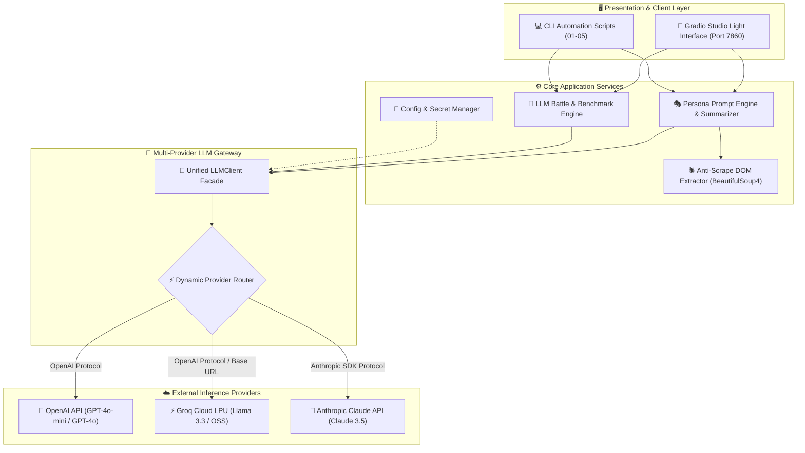

# 🏛️ High-Level Design (HLD): Multi-Provider AI Summarizer & Arena

**Project**: Multi-Provider LLM Wrapper, Anti-Scrape Web Sanitizer & Model Battle Arena  
**Version**: 1.0.0 · Production Architecture  
**Author**: AI Engineering Series

---

## 1. Executive Summary & Goals

### 1.1 Business / Product Objective
The system provides a vendor-agnostic AI platform that:
1. **Extracts and sanitizes web content** from arbitrary URLs, reducing input token footprint by **70%+**.
2. **Generates persona-driven executive summaries** across customizable prompt templates.
3. **Benchmarks multiple AI providers side-by-side** (**OpenAI**, **Groq LPU**, **Anthropic Claude**) in a live LMSYS-inspired Battle Arena with real-time latency measurement and voting.

### 1.2 Key Non-Functional Requirements (NFRs)
- **Vendor Agnosticism**: No business logic hardcoded to a single provider SDK.
- **Latency Efficiency**: Direct streaming / low overhead routing (<0.5s overhead).
- **Cost & Token Optimization**: Proactive DOM noise stripping before prompt construction.
- **Security & Secret Isolation**: Zero credential leakage via strict environment boundaries.
- **Fault Tolerance**: Non-blocking graceful error recovery when an external provider experiences rate limits or outages.

---

## 2. High-Level System Architecture Diagram



---

## 3. Component Breakdown

### 3.1 Presentation Layer (Gradio Studio UI)
- **Role**: Responsive web interface with 4 dedicated tabs (Summarizer, Battle Arena, Multi-Provider Playground, Architecture Guide).
- **Tech Stack**: Gradio 4.x, Custom CSS (Plus Jakarta Sans & JetBrains Mono), HTML5 micro-components.

### 3.2 Web Extractor & Sanitizer Service (`src/scraper.py`)
- **Role**: Fetches remote HTML, adds browser-spoofed headers, handles timeouts/redirects, and decomposes DOM noise tags (`<script>`, `<style>`, `<nav>`, `<footer>`, `<header>`, `<svg>`, `<form>`, `<aside>`).
- **Token Guard**: Enforces configurable maximum character limits (`Config.SCRAPER_MAX_CHARS = 25000`) to prevent context window overflow.

### 3.3 Persona Prompt Engine (`src/summarizer.py`)
- **Role**: Applies system persona templates (Executive Brief, ELI5, Snarky, Dev Digest, Hinglish) and formats structured markdown outputs.

### 3.4 Multi-Provider LLM Gateway (`src/llm_wrapper.py`)
- **Role**: Implements the **Adapter/Facade Pattern** to present a unified API signature:
  `generate(prompt, system_prompt, provider, model, temperature, max_tokens) -> LLMResponse`
- **Telemetry**: Measures execution round-trip latency (`time.perf_counter()`) and standardizes usage tokens.

### 3.5 Model Battle Arena (`src/arena.py`)
- **Role**: Dispatches identical prompts to two distinct models, computes speed differential, and persists community votes.

---

## 4. End-to-End Data Flow

### 4.1 Web Summarization Request Flow
1. **User Action**: User submits `https://example.com` + chooses `Executive Brief` persona.
2. **Scraper Service**: Issues HTTP GET with browser headers. Decomposes non-content HTML nodes and strips whitespace.
3. **Prompt Construction**: Merges sanitized text with selected persona system prompt.
4. **Inference Dispatch**: Routes request to selected provider (e.g., Groq LPU).
5. **Response Delivery**: Returns structured Markdown + operational latency badge to UI.

### 4.2 Battle Arena Request Flow
1. **User Action**: User submits battle prompt (e.g., "Explain recursion").
2. **Concurrent Dispatch**: Gateway dispatches prompt to Contender A (`gpt-4o-mini`) and Contender B (`llama-3.3-70b-versatile`).
3. **Benchmark Calculation**: Latencies $T_A$ and $T_B$ are measured independently.
4. **Render & Vote**: Both outputs are rendered side-by-side with speed badge. User votes are logged in memory/analytics.

---

## 5. Security & Isolation Architecture

```text
┌────────────────────────────────────────────────────────┐
│                   Development Machine                  │
│                                                        │
│  ┌──────────────┐         ┌─────────────────────────┐  │
│  │ .env (Local) │ ──────> │   src/config.py         │  │
│  │  - OPENAI    │         │   (Memory-only Loader)  │  │
│  │  - GROQ      │         └────────────┬────────────┘  │
│  │  - ANTHROPIC │                      │ (In-memory)   │
│  └──────────────┘                      ▼               │
│         │                    ┌──────────────────┐      │
│         │ (Blocked)          │  src/llm_wrapper │      │
│         ▼                    └──────────────────┘      │
│  ┌──────────────┐                                      │
│  │  .gitignore  │                                      │
│  └──────────────┘                                      │
└────────────────────────────────────────────────────────┘
                          │ (Safe Push)
                          ▼
               ┌─────────────────────┐
               │   GitHub Repository │
               │   (Zero Leaked Keys)│
               └─────────────────────┘
```

---

## 6. Technology Stack Summary

| Layer | Technologies Used | Rationale |
| :--- | :--- | :--- |
| **Language** | Python 3.10 – 3.12 | Standard runtime for AI Engineering and LLM tooling. |
| **Web UI** | Gradio 4.x + Custom CSS | Zero-boilerplate UI with native Python integration. |
| **DOM Parsing** | BeautifulSoup4 + Requests | Fast, resilient HTML tree parsing and tag decomposition. |
| **LLM SDKs** | `openai>=1.30.0`, `anthropic>=0.25.0` | Official client SDKs with unified protocol support. |
| **Testing** | `pytest>=8.0.0`, `unittest.mock` | 100% offline unit test suite with 0 token spend. |
