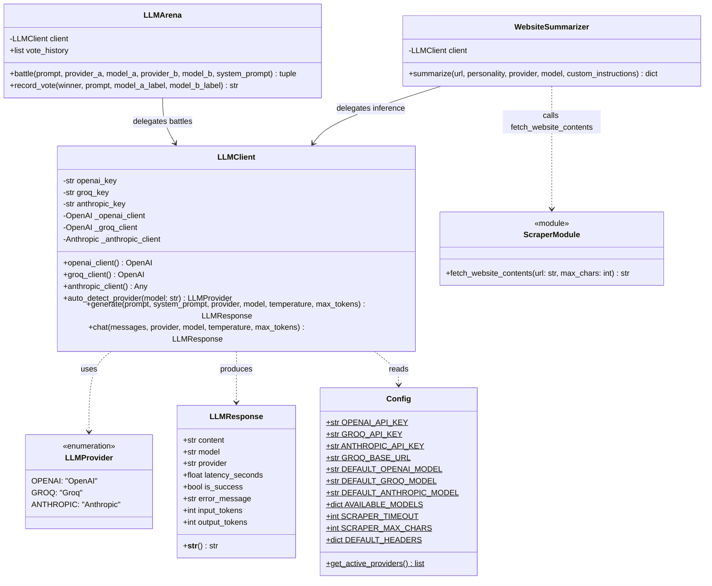
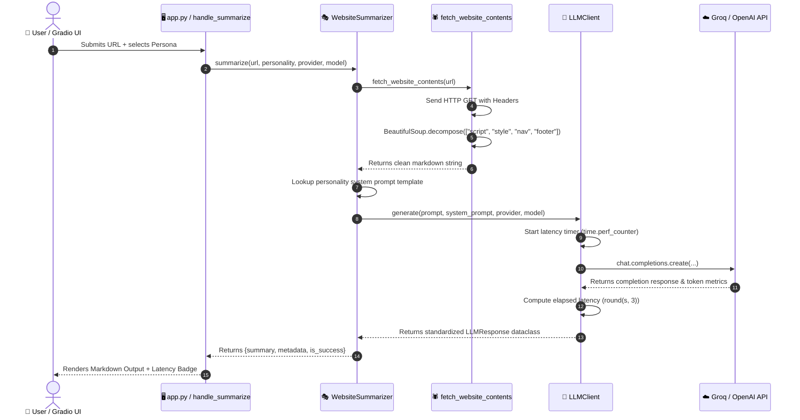
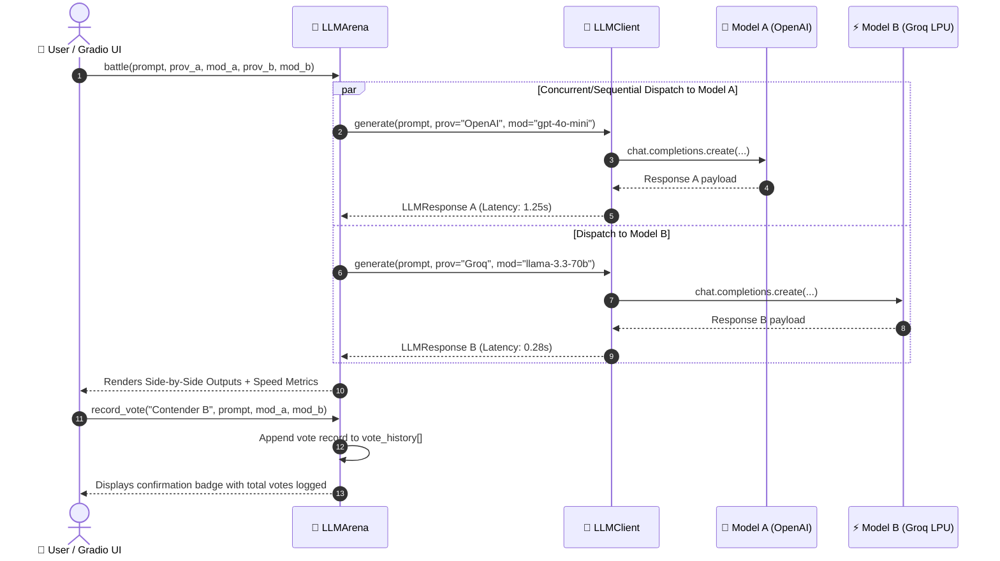

# 📐 Low-Level Design (LLD): Multi-Provider AI Summarizer & Arena

**Project**: Multi-Provider LLM Wrapper, Anti-Scrape Web Sanitizer & Model Battle Arena  
**Version**: 1.0.0 · Production Architecture  
**Author**: AI Engineering Series

---

## 1. Class Diagram (UML)



---

## 2. Sequence Diagrams

### 2.1 Website Scraping & Summarization Sequence


---

### 2.2 LLM Battle Arena & Voting Sequence


---

## 3. Detailed Component Specifications

### 3.1 `LLMResponse` (Dataclass)
```python
@dataclass
class LLMResponse:
    content: str                  # Generated markdown/text
    model: str                    # Target model string (e.g. gpt-4o-mini)
    provider: str                 # Provider name (OpenAI, Groq, Anthropic)
    latency_seconds: float        # Execution round-trip time in seconds
    is_success: bool = True       # Boolean flag indicating execution status
    error_message: Optional[str]  # Error traceback / details if is_success is False
    input_tokens: Optional[int]   # Prompt token count
    output_tokens: Optional[int]  # Completion token count
```

### 3.2 `fetch_website_contents(url: str, max_chars: int) -> str`
- **Algorithm**:
  1. Validate URL scheme (`http://` or `https://`). Auto-prepend `https://` if absent.
  2. Perform HTTP `GET` with spoofed User-Agent (`timeout=15s`).
  3. Parse DOM tree using `BeautifulSoup(html, "html.parser")`.
  4. Decompose noisy nodes: `["script", "style", "nav", "footer", "header", "noscript", "svg", "form", "iframe", "aside", "button"]`.
  5. Extract stripped text lines and collapse duplicate newlines.
  6. Truncate text at `max_chars` limit (`25,000` chars default).

---

## 4. Design Patterns Implemented

| Pattern | Where Applied | Purpose |
| :--- | :--- | :--- |
| **Facade Pattern** | `src/llm_wrapper.py::LLMClient` | Simplifies complex multi-SDK protocols into a single `.generate()` method. |
| **Adapter Pattern** | `LLMClient.chat()` | Adapts disparate API schemas (OpenAI vs Anthropic message formats) into a unified interface. |
| **Strategy Pattern** | `src/summarizer.py::SUMMARY_PERSONALITIES` | Allows dynamic interchangeable prompt behaviors at runtime. |
| **Singleton / Registry** | `src/config.py::Config` | Provides centralized, immutable access to environment configurations and model lists. |

---

## 5. Error Handling & Recovery Matrix

| Scenario | System Behavior | User Impact |
| :--- | :--- | :--- |
| **Invalid URL or 404** | Scraper catches `RequestException`, returns structured error string. | Clean warning message rendered; no uncaught exceptions. |
| **Scraper Timeout (>15s)** | Scraper catches `Timeout`, returns timeout notice. | User alerted that target website is unresponsive. |
| **Missing API Key** | Wrapper raises `ValueError`, catches in `.generate()`, sets `is_success=False`. | UI displays error badge explaining how to configure `.env`. |
| **Provider Rate Limit / Outage** | LLM client catches exception, sets `is_success=False`, returns latency metrics. | App does not crash; other provider in Arena continues functioning. |
