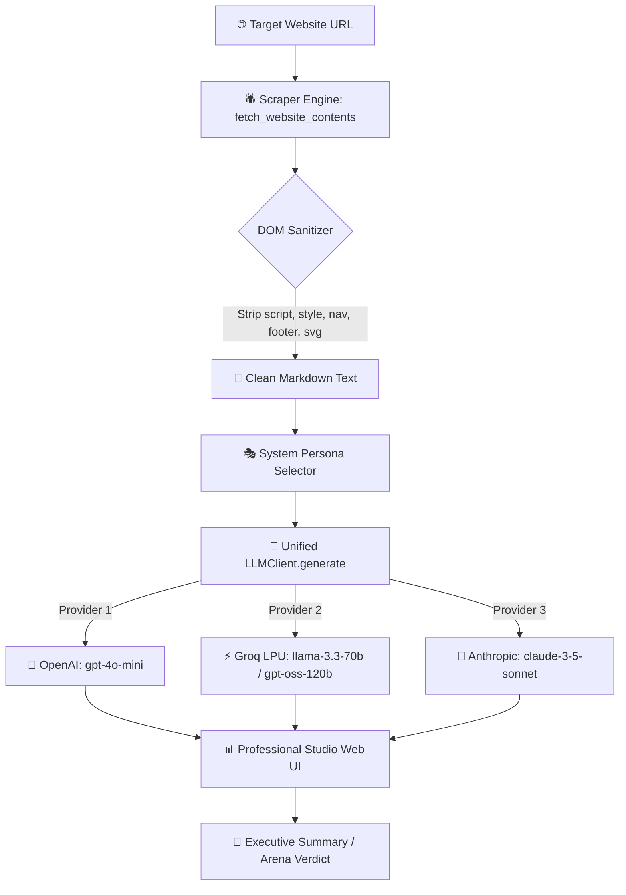

# 🚀 Multi-Provider LLM Wrapper & AI Website Summarizer

[](https://www.python.org/downloads/)
[](https://platform.openai.com)
[](https://console.groq.com)
[](https://console.anthropic.com)
[](https://gradio.app)
[](https://docs.pytest.org)
[](#-enterprise-secret-safety)

> **"Same code, different brains."** — A modular, production-ready AI application combining a vendor-agnostic multi-provider LLM interface (**OpenAI**, **Groq LPU**, **Anthropic Claude**), an intelligent anti-scrape DOM sanitizer, 6 custom prompt personas, and a head-to-head model battle arena with latency benchmarking.

---

## 🧠 Skills & Core Competencies

| Core Skill | Implementation Details |
| :--- | :--- |
| **Unified Multi-Provider Architecture** | Built a vendor-agnostic `LLMClient` wrapping **OpenAI**, **Groq**, and **Anthropic** with automatic model-to-provider routing. |
| **Token Optimization & DOM Cleaning** | Stripped non-content DOM noise (`<script>`, `<style>`, `<nav>`, `<footer>`, `<svg>`, `<aside>`) to save **70%+ LLM input tokens**. |
| **Prompt Engineering & System Personas** | Engineered 6 distinct system prompts (Executive Brief, ELI5, Snarky, Dev Digest, Hinglish) for tailored outputs. |
| **Latency & Speed Benchmarking** | Measured millisecond execution times comparing traditional cloud models against Groq's high-speed LPU inference. |
| **Side-by-Side Model Arena** | Broadcast single prompts to two competing LLMs with interactive user voting (inspired by LMSYS Chatbot Arena). |
| **Enterprise Secret Isolation** | Protected API keys using environment variables and strict `.gitignore` rules to prevent credential leaks. |
| **Automated Testing with Mocks** | Built a 100% mocked Pytest suite to validate parsing and provider logic with **zero token cost**. |

---

## 🏗️ System Architecture Flow



---

## 📁 Repository Structure

```text
├── .env.example              # Public environment template (safe for GitHub)
├── .gitignore                # Strictly prevents .env & virtual env from being tracked
├── requirements.txt          # Pinned production dependencies
├── app.py                    # 🌟 Flagship 4-in-1 Gradio Studio Web Application
│
├── src/                      # Production Core Package
│   ├── __init__.py           # Package exports
│   ├── config.py             # Central environment loader & model catalogue
│   ├── scraper.py            # DOM parsing and noise-stripping engine
│   ├── llm_wrapper.py        # Multi-provider unified LLM client
│   ├── summarizer.py         # Prompt engineering & summarization logic
│   └── arena.py              # LLM battle comparator & voting engine
│
├── scripts/                  # 5 Step-by-step educational CLI lessons
│   ├── 01_first_call.py      # OpenAI chat completion
│   ├── 02_groq_call.py       # High-speed Groq LPU call
│   ├── 03_claude_call.py     # Anthropic Claude call
│   ├── 04_scraper_demo.py    # Standalone website scraper
│   └── 05_summarizer_cli.py  # Terminal-based summarizer
│
├── tests/                    # 100% Mocked Pytest Suite (0 Token Cost)
│   ├── test_scraper.py       # Scraper & HTML sanitization tests
│   ├── test_llm_wrapper.py   # Multi-provider mock tests
│   └── test_summarizer.py    # End-to-end pipeline tests
│
└── LINKEDIN_POST.md          # Ready-to-publish announcement template
```

---

## ⚡ Quickstart Guide

### 1. Clone the Repository & Enter Folder
```bash
git clone https://github.com/your-username/ai-website-summarizer.git
cd ai-website-summarizer
```

### 2. Create and Activate Virtual Environment

**On Windows (PowerShell):**
```powershell
python -m venv .venv
.\.venv\Scripts\Activate.ps1
```

**On macOS / Linux (Bash/Zsh):**
```bash
python3 -m venv .venv
source .venv/bin/activate
```

### 3. Install Dependencies
```bash
pip install -r requirements.txt
```

### 4. Configure API Keys (Zero Secret Leakage)
Copy the template file to `.env`:

**Windows:**
```powershell
copy .env.example .env
```

**macOS / Linux:**
```bash
cp .env.example .env
```

Open `.env` and fill in your keys:
```env
OPENAI_API_KEY=sk-proj-your_openai_key
GROQ_API_KEY=gsk_your_groq_key
ANTHROPIC_API_KEY=sk-ant-your_claude_key    # Optional
```

---

## 💻 Running the Application

### Option A: Launch the Web Studio UI
```bash
python app.py
```
Open `http://127.0.0.1:7860` in your browser.

### Option B: Run Standalone CLI Lessons
```bash
# 1. Test OpenAI direct call
python scripts/01_first_call.py

# 2. Test Groq LPU call
python scripts/02_groq_call.py

# 3. Test Anthropic Claude call
python scripts/03_claude_call.py

# 4. Scrape any website from CLI
python scripts/04_scraper_demo.py https://www.python.org

# 5. Summarize any website directly in terminal
python scripts/05_summarizer_cli.py https://www.python.org
```

---

## 🧪 Running Structured Tests (Zero Token Cost)

All tests use mocks so you can verify the entire pipeline without spending API tokens:

```bash
python -m pytest tests/ -v
```

Expected Output:
```text
tests/test_llm_wrapper.py::test_provider_auto_detection PASSED           [ 10%]
tests/test_llm_wrapper.py::test_openai_generate_mock PASSED              [ 20%]
tests/test_llm_wrapper.py::test_groq_generate_mock PASSED                [ 30%]
tests/test_llm_wrapper.py::test_error_handling_graceful_recovery PASSED  [ 40%]
tests/test_scraper.py::test_empty_url_handling PASSED                    [ 50%]
tests/test_scraper.py::test_successful_scraping_and_tag_stripping PASSED [ 60%]
tests/test_scraper.py::test_http_timeout_handling PASSED                 [ 70%]
tests/test_scraper.py::test_http_404_error_handling PASSED               [ 80%]
tests/test_summarizer.py::test_summarizer_success_flow PASSED            [ 90%]
tests/test_summarizer.py::test_summarizer_scraping_error_flow PASSED     [100%]

============================= 10 passed in 1.65s ==============================
```

---

## 🔐 Enterprise Secret Safety

- 🚫 **Never hardcode secrets** in Python files.
- 🛡️ `.env` is listed in `.gitignore` by default.
- 🔍 Before committing, you can verify with:
  ```bash
  git status
  ```
  Ensure `.env` never appears in the untracked or staged list.

---

## 📢 Ready to Publish on LinkedIn!

Check out [`LINKEDIN_POST.md`](./LINKEDIN_POST.md) for pre-formatted post templates and engagement tips!
